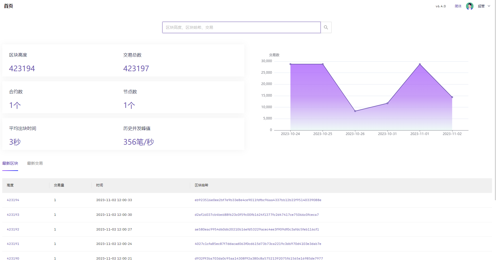
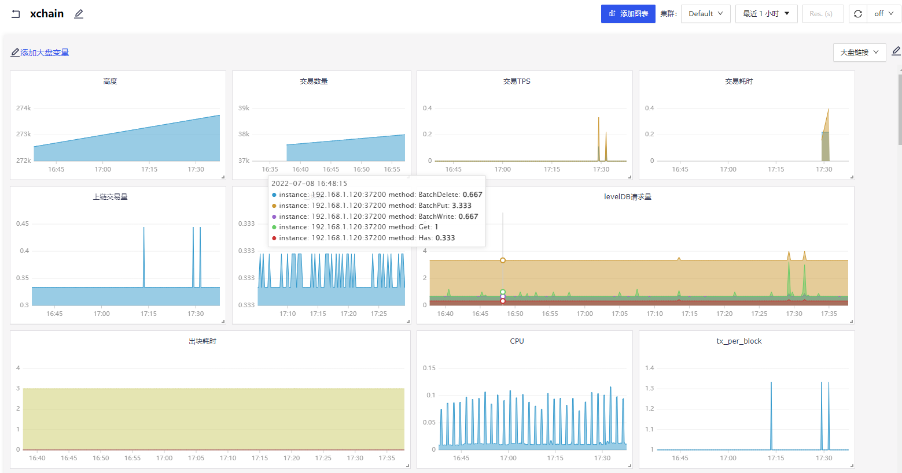

>chaineye是一款开源的区块链监控平台，目前已经支持百度XuperChain，基于[nightingale](https://github.com/ccfos/nightingale)二次开发,开箱即用的产品体验。


## 预览


## 快速安装
- 前置:需要安装Prometheus或者其他工具作为数据源。已有正在运行的XuperChain网络。
- 克隆项目到本地 项目地址 https://github.com/shengjian-tech/chaineye
- `go mod tidy`下载依赖, `go build -ldflags "-w -s" -o chaineye ./cmd/center/main.go`编译完成。
- 修改 [./etc/config.toml](./etc/config.toml) 配置文件。`config.toml` 配置中主要配置日志等级，输出路径; 服务端口;Redis连接，数据库连接;`[Reader]` 和 `[Writers]` 设置为Prometheus服务连接，或者其他数据源连接地址;`[[Clusters]]` 即Prometheus等数据源连接地址，以及 `XuperSdkYmlPath` 配置，包括超级链节点地址，超级链SDK配置文件路径。
- 修改完配置文件后，在根目录执行命令即可启动`chaineye`服务。命令 `nohup ./chaineye &` , 随后可以通过查看日志输出，判断服务是否正常启动。
- 最后，下载`chaineye`对应前端项目`front_chaineye`，仓库路径 https://github.com/shengjian-tech/front_chaineye
- 克隆前端项目后，运行 `npm install` 和 `npm run build`。
- 配置 `ngnix`。配置入下所示。
- 访问`http://127.0.0.1:port/front_chaineye/login` 页面。账号：root 密码：root.2020  
- 导入XuperChain监控大盘，XuperChain大盘文件路径 https://github.com/xuperchain/xbench/blob/master/conf/metric/grafana-xchain.json 下载后，在监控大盘中，导入即可。

## 超级链监控大盘预览


## Nginx Server 配置
```shell
 location ~ ^/front_chaineye/ {
    root html;
    index  index.html index.htm;
    try_files $uri $uri/ /front_chaineye/index.html;
}        

location ~ ^/chaineye/ {
	proxy_set_header       Host              $host;
    proxy_set_header       X-Real-IP         $remote_addr;
    proxy_set_header       X-Forwarded-For   $proxy_add_x_forwarded_for;
	proxy_pass http://127.0.0.1:17000;
}
```

- 配置完成。即可访问 `ngnix` server端口，访问 http://127.0.0.1:port/front_chaineye/   页面。

## 鸣谢
[夜莺nightingale](https://github.com/ccfos/nightingale)  
[XuperChain](https://github.com/xuperchain/xuperchain)
